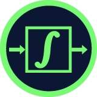

<a href="https://platzi.com/cursos/funciones-matematicas/">

<h1 align="center"><a href="https://platzi.com/cursos/funciones-matematicas/">Funciones Matemáticas para Data Science e Inteligencia Artificial</a></h1>

  

  Este proyecto fue hecho en VS Code con Jupyter Notebooks. Por
    <a href="https://github.com/DensLopez">Dennis.</a>
  

 
 

Este repositorio está relacionado al curso de <a href="https://platzi.com/cursos/funciones-matematicas/">"Funciones Matemáticas para Data Science e Inteligencia Artificial"</a> tomado en <a href="https://platzi.com">Platzi.</a> Además, contiene archivos ["ipynb"](codes), ["html"](codes/html/) y ["pdf"](codes/pdfs/) con los códigos desarrollados en el curso y explicaciones por cada archivo.
 

<h1 align="center">Acerca de </h1>
Aprende qué es una función matemática y cómo puedes aplicarlas en el mundo de la ciencia de datos e inteligencia artificial. Domina los diferentes tipos de funciones que existen, entiende cómo leer las matemáticas y aprende a calcular errores.

 

## Temario

### Aprendamos lo elemental

- ¿Qué es una función? - [code001.ipynb](codes/code001.ipynb), [code001.pdf](codes/pdfs/code001.pdf).
- Tipos de variables - [code002.ipynb](codes/code002.ipynb), [code002.pdf](codes/pdfs/code002.pdf).
- Dominio y rango de una función - [code003.ipynb](codes/code003.ipynb), [code003.pdf](codes/pdfs/code003.pdf).
- Cómo leer las matemáticas: símbolos generales - [code004.ipynb](codes/code004.ipynb), [code004.pdf](codes/pdfs/code004.pdf).
- Cómo leer las matemáticas: conjuntos - [code005.ipynb](codes/code005.ipynb), [code005.pdf](codes/pdfs/code005.pdf).

### Todo sobre funciones

- Funciones algebraicas lineales - [code006.ipynb](codes/code006.ipynb), [code006.pdf](codes/pdfs/code006.pdf).
- Funciones algebraicas polinómicas - [code007.ipynb](codes/code007.ipynb), [code007.pdf](codes/pdfs/code007.pdf).
- Funciones trascendentes - [code008.ipynb](codes/code008.ipynb), [code008.pdf](codes/pdfs/code008.pdf).
- Funciones seccionadas - [code009.ipynb](codes/code009.ipynb), [code009.pdf](codes/pdfs/code009.pdf).
- Funciones compuestas - [code010.ipynb](codes/code010.ipynb), [code010.pdf](codes/pdfs/code010.pdf).
- ¿Cómo maniupular funciones - [code011.ipynb](codes/code011.ipynb), [code011.pdf](codes/pdfs/code011.pdf).
- Características de las funciones - [Extra01.ipynb](codes/extra01.ipynb), [Extra01.pdf](codes/pdfs/extra01.pdf)

### Funciones en ciencia de datos

- Conoce el perceptrón - [code012.ipynb](codes/code012.ipynb), [code012.pdf](codes/pdfs/code012.pdf).
- Funciones de activación - [code013.ipynb](codes/code013.ipynb), [code013.pdf](codes/pdfs/code013.pdf).
- Entendiendo la regresión lineal simple - [code014.ipynb](codes/code014.ipynb), [code014.pdf](codes/pdfs/code014.pdf).
- ¿Cómo se calcula un error? - [code015.ipynb](codes/code015.ipynb), [code015.pdf](codes/pdfs/code015.pdf).

### Este no es el fin

- Te has iniciado detrás del secreto de la ciencia de datos.
- Quiz final - [Quiz final](codes/pdfs/extra02.pdf)

 
